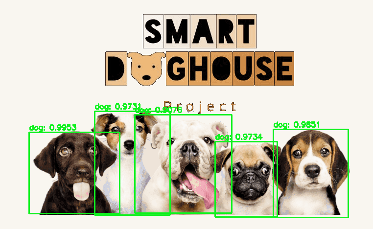

# SmartDogHouse-SurveillanceSystem
Software for surveillance. Uses OpenCV for capturing video, running Object-Detection, sending MQTT message for anomalies, streaming video as a server.


*actual results of an example image passed through the neural network

[](https://www.codefactor.io/repository/github/smartdoghouse/smartdoghouse-surveillancesystem/overview/main)
[](https://www.codacy.com/gh/SmartDogHouse/SmartDogHouse-SurveillanceSystem/dashboard?utm_source=github.com&amp;utm_medium=referral&amp;utm_content=SmartDogHouse/SmartDogHouse-SurveillanceSystem&amp;utm_campaign=Badge_Grade)
## Install OpenCV
```bash
sudo apt-get install python3-opencv
```

test with
```bash
import cv2
```
## Install ffmpeg
```bash
sudo apt install ffmpeg
```

if you are using VirtualBox add usb device :
devices -> usb -> settings -> add -> select your camera.

test it with ffmplay
```bash
ffmplay /dev/video0
```

at this point, you should be able to test if everything is correct with _camera_tester.py_
it should detect a device and display a window with the view. 

you should be also able to execute the _motion_detection_base.py_

## (for object detection) Download models
to use the neural network (NN) for object detection for the security system,
you should download the models of the net. You can find some scripts in the _model_ folder
```bash
bash ./download_yolo_v3_model.sh
```
then you can use the file _object_detection_base.py_ with the params to pass the model of the NN you prefer.

## (for MQTT notifications) Install MQTT client
both motion detection and object recognition systems can send an MQTT message if an anomaly is detected.
The IoT sdk of Amazon AWS has been used:
```bash
pip install awsiotsdk
```
Remember to download cert, key. Put it in the flash folder and set up the _secret.py_ file with the path to them.
In this file you can also write the aws  mqtt host, the mqtt port, client_id and topic.

You can test it with the class _mqtt_tester.py_

Then you can use the file _object_detection_mqtt.py_ or _motion_detection_mqtt.py_ to get a notification when an anomaly is detected.

## (for streaming as a web server) Install Flask
If you want to stream as well the video you can download Flask, a micro web framework written in Python.
```bash
pip install flask
```
You can test it with _stream_base.py_ and connect with a browser to localhost:5000

Now you should also be able to execute _motion_detection_mqtt_stream.py_
### streaming over the internet
If you want to test stream outside you local network, you can use a service like "ngork" or any equivalent alternative.
It has been tested with Ngrok so for completeness:
- connect to the website, register, download Ngrok for your OS.
```bash
unzip /path/to/ngrok.zip
./ngrok authtoken <your auth otoken>
```
- execute the stream file with python
```bash
ngrok tcp 5000 -region eu #(Specify between one of (us, au, ap, eu).)
```
- collect the address, you can connect to it and watch the stream from anywhere!

## Passing video frames from one device to another in the net.
if you need to pass the video frames from one device to another (to group cameras) (or for advanced elaboration to images):
you can use the samples: _sender_udp-py_ and _receiver_udp.py_

## License

This project is under a License - see the [LICENSE](LICENSE) file for details
